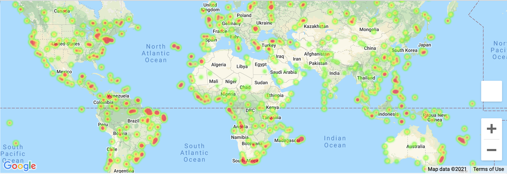

# What's the Weather Like?

## Introduction

By using Python requests, APIs, and JSON traversals to answer a fundamental question: "What's the weather like as we approach the equator?". In this challenge, I used the weather of 500+ cities across the world of varying distance from the equator.

## WeatherPy
### Data/Tools
* [citipy Python library](https://pypi.python.org/pypi/citipy)
* [OpenWeatherMap API](https://openweathermap.org/api)
* Python
* Matplotlib
* Pandas

### Analysis
Create a series of scatter plots to showcase the following relationships:
* Temperature (F) vs. Latitude
* Humidity (%) vs. Latitude
* Cloudiness (%) vs. Latitude
* Wind Speed (mph) vs. Latitude

Run linear regression on each relationship and separate them into Northern Hemisphere (greater than or equal to 0 degrees latitude) and Southern Hemisphere (less than 0 degrees latitude):

## VacationPy
### Data
* Jupyter-gmaps
* The Google Places API
* Python
* Pandas

### Analysis
* Create a heat map that displays the humidity for every city from the WeatherPy

* Narrow down the DataFrame to meet all of the below weather conditions:
  * A max temperature lower than 80 degrees but higher than 70
  * Wind speed less than 10 mph
  * Zero cloudiness
* Using Google Places API to find the first hotel for each city located within 5000 meters of your coordinates
* Plot the hotels on top of the humidity heatmap with each pin containing the **Hotel Name**, **City**, and **Country**

## Copyright

Trilogy Education Services © 2021. All Rights Reserved.
